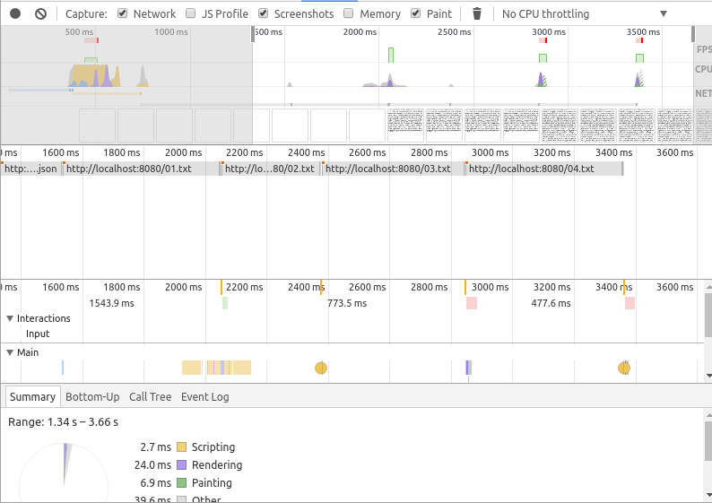
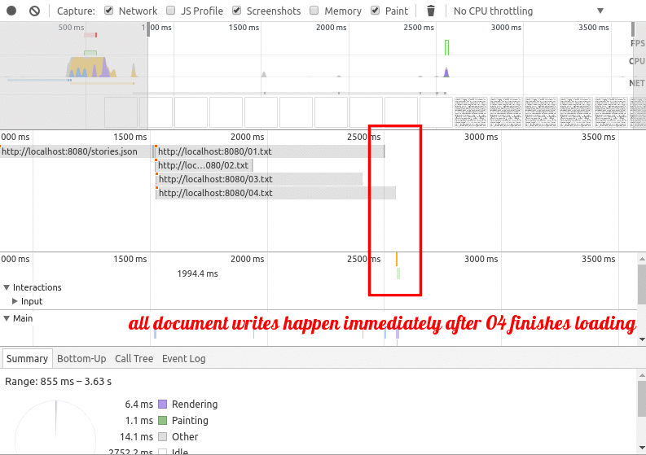
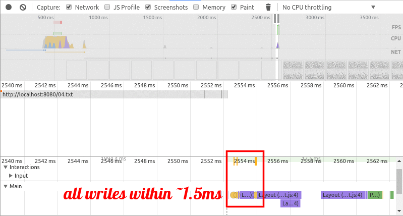
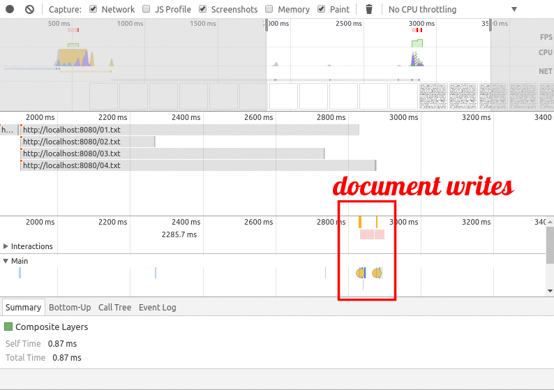
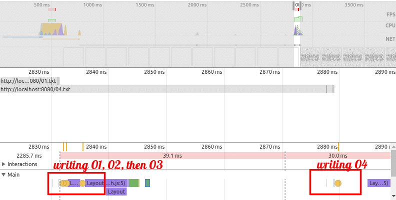

# Promise Fun

Review of my findings from testing a small app I made *heavily* inspired by Jake Archibald's [Promises](https://developers.google.com/web/fundamentals/getting-started/primers/promises) article.
This is primarily written to help me visualize async better.

 - Load all of its content in sequence
 - Load all of its content in parallel
 - Load all of its content in parallel but display in sequence (faster!)

--------

# Sequential Loading

Promises give us a nice way to chain multiple tasks together. This differs greatly in style from the all too well known "callback hell". Chaining multiple asynchronous tasks together
to form a sequence is as simple as this:

```js
let sequenceChain = getFirstPromise
  .then(data => {
    processDataSync(data);
    return getSecondPromise();
  })
  .then(data => {
    processDataSync(data);
    return getThirdPromise();
  })
  .then(data => {
    processDataSync(data);
    return getFourthPromise();
  })
```

We certainly could write out all of the above operations manually to form a sequence however, we'd be fools to not create it programmatically. After all, we are programmers.
In order to produce a sequence like the above without actually struggling through every last character we could use a loop to keep appending asynchronous operations on to some
initial promise chain.

Consider the following example where we build a promise chain iteratively so that it can be evaluated sequentially:

```js
let sequenceChain = Promise.resolve();

function loadStories(urls) {
  urls.forEach((url, i) => {
    console.log(`Chain is ${i+1} promise long`)
    sequenceChain = sequenceChain.then(_ => {
      console.log('Starting one fetch');
      return fetch(url);
    }).then(data => {
      console.log('Got one finished');
    });
  })
}

const base = "https://domfarolino.com";
loadStories([`${base}/`, `${base}/resume/`, `${base}/public-keys/`]);

for (var i = 0; i < 1e5; ++i) {
  for (j = 0; j < 1e4; ++j) {}
}
```

Since `Array.prototype.forEach` is a form of synchronous iteration it will finish before we see the results of any asynchronous content happening inside. In other words, the loop
lets us build the entirety of the promise chain before we see the output of any `.then()` handler. This is because everything in a `.then()` gets pushed onto the event loop. For
example, guess the output of the following code and then try running it in your browser.

```js
Promise.resolve().then(() => {console.log('Resolve finish')});
console.log('Sync as heck');
```

Now consider the following:

```js
Promise.resolve().then(() => {console.log('Resolve finish')});
setTimeout(() => {console.log('A-Sync as heck')}, 0);
```

Ahh, the age-old battle of the event loop. Sure `Promise.resolve()` resolves synchronously (we don't have to wait for next tick to see that the promise resolved), however *still* the
contents of the `.then()` handler is always executed after everything on the stack clears. To really drive it home see [specification](https://promisesaplus.com/#point-34).

To see a fully functioning example visit [this](sequence.html) page and/or see [this](sequence.js) code. In the example (which gets repeated and modified for the next two sections)
I load four largeish text files ([`01.txt`](01.txt), [`02.txt`](02.txt), [`03.txt`](03.txt), and [`04.txt`](04.txt)) to display the user via some JavaScript.

I recorded a timeline of the site in DevTools so you can easily see the order in which network requests were made. It is worth noting all of the timeline recording was done on a very
throttled connection to make gaps more obvious. I also marked the time line via the `console.markTimeLine()` function whenever the JavaScript performs a `document.body.innerText += ...`.
The console markings (denoted by yellow circles) give us a good way to compare when a document write happens compared to the resolving of a network request.

While testing this I got pretty much what I expected in DevTools.



Above we can see that no network request is made before another resolves. This is textbook sequential loading. Furthermore you can also see several yellow dots (it appears some are covered up)
indicating when the files that are loaded get written to the screen. No surprise in this case the writing happens **right** after each file is loaded. Neat eh?

---------------

# Concurrent Loading

The purely concurrent version of this code is rather boring since we let `Promise.all()` have all the fun. `Promise.all()` takes in an array of promises, waits for every single Promise
to fulfill, and then returns an array of values (which may be promises too of course). In the case of `fetch`, `Promises.all()` leaves us with an array of `Response` objects returned by
each `fetch`. If you're at all familiar with the `Response` [API](https://developer.mozilla.org/en-US/docs/Web/API/Body/text) you'll know it has a `.text()` function (among others) which
returns a promise that resolves to the textual content of the response more or less. You can probably imagine how this code looks.

To see a fully functioning example visit [this](concurrent.html) page and/or see [this](concurrent.js) code.

Testing this yielded pretty much what I expected in DevTools.



We can see several writes to the document all bunched up together **right** after `04.txt` finishes loading. This is what we expect since we're refusing to handle *any* promise until *all*
resolve when using `Promise.all()`.



A closer look shows all of our writes are happening in an incredibly small amount of time which makes sense. Though the metric in the picture is wrong, they're happening very quickly!

# Concurrent and Sequential Loading

The main issue with purely concurrent loading is that `Promise.all()` will wait for *every single* promise it has to resolve. So what if we pass in 6 promises, and the first 5 resolve
quickly but the sixth is taking a while? The user will never get to see the data resulting in *any* of the promises until they *all* resolve. This poses a big threat to the perceived
performance of a site.

How about the main issue with purely sequential loading? As you can see in the above sequential example we're not even kicking off the `fetch` of some data until *all* of the promises
before it resolve. This kinda sucks since the browser is pretty good at making multiple (~6?) concurrent network requests. By not taking advantage of this, we're pretty much wasting free
resources.

Instead of purely sequential or purely concurrent loading a healthy mix of the two is "just right".


What we need to do is kick off (alert the browser of) all of our fetches so the browser can take a stab at the network and start fulfilling promises quicker, but then to ensure things don't
get thrown at the user out of order we need to build a sequence out of our array of promises returned by fetch. We can synchronously iterate over this array of promises and create a chain
just like we did in the sequential loading example. The only difference is this time inside our loop we won't be `fetch`ing any content to get a promise. Instead we'll just be using the promises
we got by fetching ahead of time. Brilliant!

```js
let sequenceChain = Promise.resolve();

function loadStories(urls) {
  // Kicks off all downloads concurrently
  let networkPromises = urls.map(url => fetch(url));

  // This gives us sequential behavior
  networkPromises.forEach(networkPromise => {
    sequenceChain = sequenceChain.then(_ => {
      return networkPromise;
    })
    .then(networkResponse => networkResponse.text())
    .then(console.log);
  })
}

const base = "https://domfarolino.com";
loadStories([`${base}/`, `${base}/resume/`, `${base}/public-keys/`]);
```

To see a fully functioning example visit [this](both.html) page and/or see [this](both.js) code.

While testing this I got pretty much what I expected in DevTools.



You can see that even though `02.txt` and `03.txt` finish loading before `01.txt` we only write them to the document **right** when `01.txt` finishes loading, because that's the earliest we can
write them. Finally `04.txt` finishes loading and we can write that too.



A closer look really hammers down the sequential aspect of this. Right when `01.txt` finishes `02.txt` and `03.txt` get written immediately, since their promises have already fulfilled. You can see
our `document.body.innerText += ...` triggering layout in the browser too.